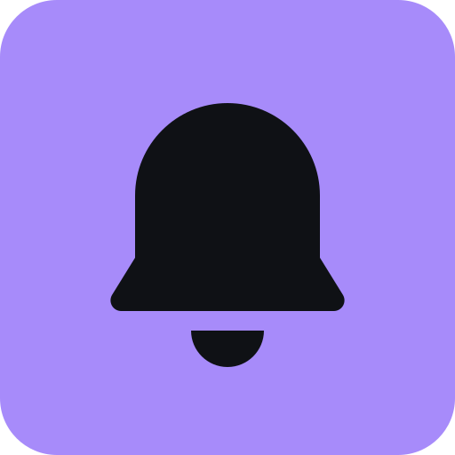

# Agent Notifications

Your agents report here. A self-hosted push inbox for AI agents: deploy one
Cloudflare Worker, and any agent that can make an HTTP request can send an
update to your phone, or **ask you a question and wait for your answer** before
it carries on.

Think "ntfy for agents, with a reply button". One person, one hub, no vendor.

<p align="center"></p>

## What it is

- **Push updates.** Milestones and failures arrive as notifications on every
  device you signed in on. Priority 0 stays in the app, 1 notifies, 2 rings
  through quiet hours.
- **Ask and wait.** An agent posts a question and polls until you answer. A
  short question with two or three short options is answerable straight from
  the notification, so a decision costs one tap.
- **Structured messages.** Agents send typed blocks (markdown, progress, table,
  key-values, buttons, form), validated against a schema and rendered by the
  app. Agent text is never treated as HTML.
- **One inbox for every agent.** Claude Code, Codex, Cursor, a cron job, a
  shell script: anything with a bearer token and an HTTP client.
- **Free to run.** One Worker, one D1 database, one KV namespace. No Durable
  Object unless you switch one on.
- **Optional end-to-end encryption.** With an encryption key set, block content
  is encrypted before it leaves your machine and the hub stores ciphertext.

## Deploy your own

You need a Cloudflare account, Node 22.12 or newer, and pnpm.

```bash
git clone https://github.com/Qu4tro/agent-pwa-notifications.git
cd agent-pwa-notifications
pnpm install --frozen-lockfile
pnpm exec wrangler login

pnpm exec wrangler d1 create agent-dash         # paste the printed ids
pnpm exec wrangler kv namespace create SESSIONS # into wrangler.jsonc

pnpm setup    # generates keys, sets the secrets, migrates, deploys
```

`pnpm setup` prints the hub URL. Sign in once by one-time code (with no email
sender configured, read the code from `pnpm exec wrangler tail`); that first
sign-in creates the account and shows its agent key once. Then open the hub on
your phone, add it to the home screen, and turn notifications on in Settings.

[public_docs/deploy.md](public_docs/deploy.md) has the full walkthrough: the
vars, the secrets, closing registration with `ALLOWED_EMAILS`, signing in on a
second device, and what to check when a notification does not arrive.

## Connect an agent

**MCP**, for Claude Code, Cursor, Codex, or any MCP client:

```json
{
  "mcpServers": {
    "agent-notifications": {
      "url": "https://<your-worker>.workers.dev/mcp",
      "headers": { "Authorization": "Bearer <your account key>" }
    }
  }
}
```

Five tools: `notify` (post an update), `update` (change one in place, which is
how live progress works), `ask` (post a question, get an id), `wait_for_answer`
(poll that id), `clear` (tidy the inbox).

**Skill**, for any runtime that reads Agent Skills:

```bash
npx skills add Qu4tro/agent-pwa-notifications
```

That installs [`skills/agent-notifications`](skills/agent-notifications/SKILL.md),
which documents the endpoints this hub really implements. Give the agent your
hub URL and your account key and it can post without further wiring.

**CLI**, for scripts and hooks:

```bash
agent-notify-pwa login                       # save and verify a hub URL and key
agent-notify-pwa connect                     # write ./.mcp.json for an MCP client
agent-notify-pwa notify "Build finished" --priority 1 --project API
agent-notify-pwa ask "Ship it?" --button Ship --button Hold
agent-notify-pwa open                        # one-time sign-in link, with a QR
```

`ask` blocks until the question is answered or expires and prints the answer as
JSON, so it composes:

```bash
CHOICE=$(agent-notify-pwa ask "Ship it?" --button Ship --button Hold | jq -r .choice)
```

Run it from a checkout with `node cli/bin.mjs <command>`, or install the AUR
package `agent-pwa-notifications` on Arch Linux, which puts `agent-notify-pwa`
on the PATH. [cli/README.md](cli/README.md) documents every command and flag.

**Plain HTTP**, for anything else:

```bash
curl -X POST "$AGENT_NOTIFY_PWA_URL/api/v1/events" \
  -H "Authorization: Bearer $AGENT_NOTIFY_PWA_KEY" \
  -H "Content-Type: application/json" \
  -d '{"title":"Build finished","project":"API","priority":1}'
```

Your own hub serves the contract: `GET /api/v1/openapi.json` for the endpoints
(importable as a ChatGPT Action) and `GET /api/v1/schema.json` for the block
types.

**Claude Code hooks**: drop-in start, finish and needs-input pushes in
[examples/claude-code-hooks](examples/claude-code-hooks).

## Notifications

A question carries its answers as notification buttons when the title is at
most 80 characters, the blocks hold exactly one `buttons` block with two or
three options of at most 20 characters, and the question is not encrypted.
Anything larger opens the thread instead. How many buttons appear depends on
the browser, which the service worker asks through `Notification.maxActions`.

Two taps can race, one from the phone and one from the desktop; the first
answer wins and the second gets a 409.

[public_docs/notifications.md](public_docs/notifications.md) has the rules, the
per-browser results, what each tap does, and why encrypted questions never get
buttons.

## How it works

```
agents  --POST /api/v1/events------>  Cloudflare Worker
        --POST /api/v1/questions--->    |- /api/v1/*  agent REST, bearer key
        <-GET  /api/v1/questions/:id    |- /mcp       stateless MCP
                                        |- /          the app, cookie session
you     <-- Web Push (VAPID) ---------  |- D1 (events, questions, subscriptions)
        --- poll the feed while open->  |- KV (sessions)
                                        |- cron, hourly: expire and prune
```

- **Delivery is Web Push plus polling.** An agent polls its own question every
  few seconds; the app polls a cursor feed only while a tab is open. One person
  stays well inside the free limits.
- **The front end reads from a cache first.** Queries are persisted, so a
  navigation paints from what is already there and refetches behind it. A
  reload with the network down still shows the last inbox.
- **Two credentials, two jobs.** The account key lets an agent post and poll;
  `APP_SECRET` signs the browser session. They rotate independently, and
  "sign out everywhere" bumps an epoch that voids every session at once.
- **Blocks, not markup.** Agent messages are `zod`-validated typed blocks and
  the app renders a known set. Nothing an agent sends is executed.

## Instant mode

Polling is the default. For sub-second updates set `"INSTANT": "1"` in the
`wrangler.jsonc` vars and deploy: the app switches to a WebSocket served by one
hibernating Durable Object, which does not bill while it sleeps. Set it back to
`"0"` to return to polling.

## Development

```bash
pnpm install --frozen-lockfile
pnpm dev          # local, needs .dev.vars (copy .dev.vars.example)
pnpm typecheck
pnpm test
pnpm build
```

[public_docs/development.md](public_docs/development.md) covers the layout, the
test harness, adding an endpoint or a block type, and pulling changes from
upstream. [public_docs/release.md](public_docs/release.md) covers cutting a
release.

Built with TanStack Start (React 19) on Cloudflare Workers, D1 and KV, Tailwind
4, and a hand-rolled VAPID and RFC 8291 push implementation on WebCrypto with
no Node dependencies.

## Credits

A fork of [Prajeevan/agent-dash](https://github.com/Prajeevan/agent-dash) by
Prajeevan, kept for one self-hosted deployment. Upstream history is preserved
in this repository, and upstream's design is the one underneath: the block
model, the Worker layout and the push implementation are theirs.

What this fork changes:

- Sign-in without an email provider: the account key mints a one-time link, so
  a phone gets in with a QR code instead of an inbox round trip.
- `ALLOWED_EMAILS` closes registration on a hub that does have an email sender.
- The skill and the MCP tools describe the endpoints this server implements,
  with no hosted-service tier and no capability negotiation.
- Notification answers: a first-answer-wins write, a button rule that stops
  hiding answers behind "More", and a session long enough that a tap on a
  notification is not a trip through the sign-in page.
- A test suite, a release workflow, and a data layer that paints from cache.
- A compact single-column interface where colour carries meaning.

## License

MIT, upstream's and this fork's. See [LICENSE](LICENSE).
